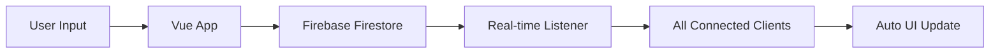

# Gabut - Anonymous Message Platform

> 🚀 Aplikasi realtime voting untuk pesan dengan sistem upvote/downvote yang interaktif dan sinkronisasi cloud

Gabut adalah aplikasi web modern yang memungkinkan pengguna untuk berbagi pesan secara anonim dan memberikan vote (upvote/downvote) secara realtime. Aplikasi ini dilengkapi dengan sistem ranking, sorting, dan penyimpanan data cloud menggunakan **Firebase Firestore** untuk sinkronisasi multi-device.

## ✨ Fitur Utama

### 🔥 Core Features

- **☁️ Cloud Synchronization** - Data tersinkron real-time di semua perangkat menggunakan Firebase Firestore
- **🗳️ Real-time Voting System** - Upvote dan downvote pesan secara instant dengan update otomatis
- **📝 Anonymous Messaging** - Input dan submit pesan tanpa registrasi
- **🌐 Cross-Device Access** - Akses data dari perangkat manapun, data tidak akan hilang
- **📱 Responsive Design** - Tampilan optimal di desktop, tablet, dan mobile

### 🚀 Advanced Features

- **🔄 Multi-mode Sorting**:
  - 🏆 Skor Tertinggi ke Terendah
  - 📉 Skor Terendah ke Tertinggi
  - 🕐 Pesan Terbaru
  - 📅 Pesan Terlama

- **🏅 Dynamic Ranking System**:
  - 🥇 Badge Top #1 (Gold) dengan highlight khusus
  - 🥈 Badge Top #2 (Silver) dengan border abu-abu
  - 🥉 Badge Top #3 (Bronze) dengan border orange
  - 📊 Real-time rank updates

- **🎨 Interactive UI/UX**:
  - Animasi hover dan click effects dengan scale transform
  - Visual feedback berdasarkan skor (color-coded)
  - Border dinamis untuk ranking dan skor
  - Loading states dan error handling
  - Detailed vote statistics dengan counter
  - Real-time message updates tanpa refresh

## 🛠️ Tech Stack

- **Frontend Framework**: Vue.js 3 (Composition API)
- **Build Tool**: Vite 7.x
- **Styling**: Tailwind CSS (via CDN)
- **State Management**: Vue Reactive & Computed Properties
- **Backend/Database**: Firebase Firestore (NoSQL Cloud Database)
- **Real-time Updates**: Firebase onSnapshot (WebSocket-based)
- **Authentication**: Firebase (ready for future implementation)
- **Hosting**: Compatible with Vercel, Netlify, Firebase Hosting
- **Language**: JavaScript ES6+ with modern async/await

### 🔥 Firebase Services Used

- **Firestore Database** - Real-time NoSQL database
- **Firebase SDK v9+** - Modular SDK for optimized bundle size
- **Security Rules** - Server-side validation and access control

## 🚀 Installation & Setup

### Prerequisites

- **Node.js** (v20.19.0 atau lebih tinggi)
- **npm** atau yarn
- **Firebase Account** (gratis)

### 🔧 Quick Setup

1. **Clone repository**

   ```bash
   git clone https://github.com/gbennnn/gabut.git
   cd gabut-v2
   ```

2. **Install dependencies**

   ```bash
   npm install
   ```

3. **Setup Firebase**

   ```bash
   # Copy template Firebase config
   cp src/firebase.template.js src/firebase.js
   ```

4. **Configure Firebase**
   - Buat project baru di [Firebase Console](https://console.firebase.google.com/)
   - Enable Firestore Database
   - Copy config dari Project Settings
   - Paste ke `src/firebase.js`
   - Lihat panduan lengkap di `FIREBASE_SETUP.md`

5. **Run development server**

   ```bash
   npm run dev
   ```

6. **Open browser**
   ```
   http://localhost:5173
   ```

### 🔐 Security Setup

**PENTING**: File `firebase.js` berisi API keys sensitif dan sudah di-exclude dari git.

```bash
# File ini akan di-ignore oleh git
src/firebase.js

# Yang di-commit ke GitHub hanya template
src/firebase.template.js
```

### 📦 Production Build

```bash
# Build untuk production
npm run build

# Preview build hasil
npm run preview

# Deploy ke hosting (contoh: Vercel)
npm run build && vercel --prod
```

## 📊 Data Structure

### Message Object (Firestore Document)

```javascript
{
  id: String,              // Auto-generated Firestore document ID
  text: String,            // Message content (max 1000 chars)
  upvotes: Number,         // Total upvotes (default: 0)
  downvotes: Number,       // Total downvotes (default: 0)
  timestamp: Timestamp,    // Firebase server timestamp
  createdAt: String        // ISO string for backup sorting
}
```

### Firestore Collection Structure

```
📁 messages (collection)
  📄 documentId1
    ├── text: "Hello world!"
    ├── upvotes: 5
    ├── downvotes: 1
    ├── timestamp: Firebase Timestamp
    └── createdAt: "2025-08-04T12:00:00.000Z"
  📄 documentId2
    ├── text: "Another message"
    ├── upvotes: 2
    ├── downvotes: 0
    └── ...
```

### Real-time Data Flow



## 🔒 Security & Privacy

### Firestore Security Rules

```javascript
rules_version = '2';
service cloud.firestore {
  match /databases/{database}/documents {
    match /messages/{messageId} {
      // Anyone can read messages
      allow read: if true;

      // Anyone can create messages with proper structure
      allow create: if request.resource.data.keys().hasAll(['text', 'upvotes', 'downvotes', 'timestamp']) &&
        request.resource.data.text is string &&
        request.resource.data.text.size() <= 1000;

      // Anyone can update upvotes/downvotes only
      allow update: if request.resource.data.diff(resource.data).affectedKeys().hasOnly(['upvotes', 'downvotes']);

      // No deletes allowed
      allow delete: if false;
    }
  }
}
```

### Privacy Features

- 🔒 **Fully Anonymous** - No user registration or tracking
- 🛡️ **Server-side Validation** - Firebase rules prevent malicious data
- 🚫 **No Personal Data** - Only message content and votes stored
- 🌐 **HTTPS Only** - All Firebase communication encrypted

## 🚨 Troubleshooting

### Common Issues

**❌ "Missing or insufficient permissions"**

```bash
# Solution: Update Firestore rules in Firebase Console
allow read, write: if true;
```

**❌ "Failed to connect to Firestore"**

```bash
# Check firebase.js config and internet connection
# Verify Firebase project ID and API keys
```

**❌ "Collection 'messages' not found"**

```bash
# Create collection manually in Firebase Console
# Collection ID: messages
```

Lihat panduan lengkap di:

- 📚 `FIREBASE_SETUP.md` - Setup Firebase step-by-step
- 🔐 `FIREBASE_SECURITY.md` - Security best practices
- 🔍 `TROUBLESHOOT.md` - Debugging guide

## 🤝 Contributing

We welcome contributions! Here's how to get started:

### Development Workflow

1. **Fork repository**
2. **Create feature branch**
   ```bash
   git checkout -b feature/amazing-feature
   ```
3. **Setup Firebase**
   ```bash
   cp src/firebase.template.js src/firebase.js
   # Add your Firebase config
   ```
4. **Make changes and test**
   ```bash
   npm run dev
   ```
5. **Commit changes**
   ```bash
   git commit -m 'feat: add amazing feature'
   ```
6. **Push to branch**
   ```bash
   git push origin feature/amazing-feature
   ```
7. **Open Pull Request**

### 🚫 What NOT to Commit

- `src/firebase.js` (contains API keys)
- `.env` files with secrets
- `node_modules/`
- Personal configuration files

### 📝 Commit Convention

Use [Conventional Commits](https://www.conventionalcommits.org/):

- `feat:` - New features
- `fix:` - Bug fixes
- `docs:` - Documentation updates
- `style:` - Code style changes
- `refactor:` - Code refactoring
- `test:` - Adding tests
- `chore:` - Maintenance tasks

## 📋 Features Roadmap

### ✅ Completed

- ✅ Firebase Firestore integration
- ✅ Real-time message sync
- ✅ Voting system with real-time updates
- ✅ Responsive design
- ✅ Security rules implementation
- ✅ Cross-device data persistence

### 🚧 In Progress

- 🔄 Rate limiting for spam prevention
- 🔄 Message character counter
- 🔄 Better error handling

### 🎯 Planned

- 📱 PWA (Progressive Web App) support
- 🔐 Optional user authentication
- 🏷️ Message categories/tags
- 📈 Analytics dashboard
- 🌙 Dark mode theme
- 🌍 Multi-language support
- 🔔 Push notifications
- 📊 Vote statistics charts

## 📜 License

Distributed under the **MIT License**. See `LICENSE` for more information.

## 🔗 Links

- 🌐 **Live Demo**: [gabut-app.vercel.app](https://gabut-app.vercel.app) _(coming soon)_
- 📚 **Documentation**: See `/docs` folder
- 🐛 **Report Bug**: [GitHub Issues](https://github.com/gbennnn/gabut/issues)
- 💡 **Request Feature**: [GitHub Discussions](https://github.com/gbennnn/gabut/discussions)

## 👨‍💻 Author

**Gabriel Benony**

- 🐙 GitHub: [@gbennnn](https://github.com/gbennnn)
- 🐦 Twitter: [@iambeno\_](https://twitter.com/iambeno_)
- 💼 LinkedIn: [benonygabriel](https://linkedin.com/in/benonygabriel)

---

<div align="center">
  <p>⭐ Star this repo if you find it helpful!</p>
  <p>Made with ❤️ using Vue.js and Firebase</p>
</div>
