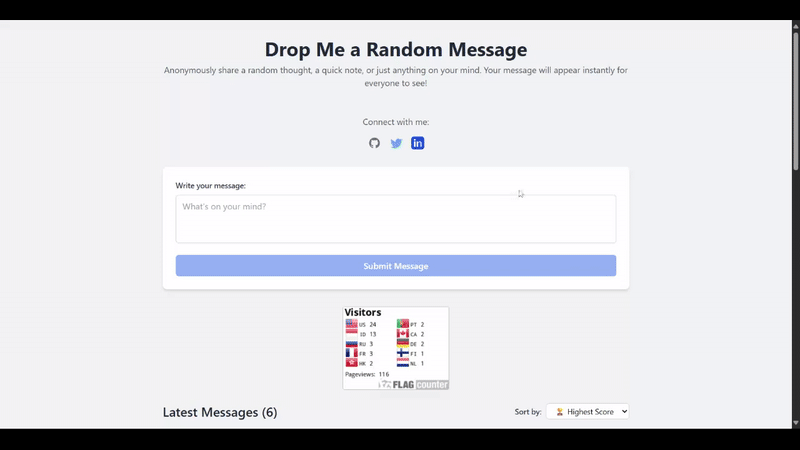

# Gabut - Anonymous Message Platform

A modern web application that allows users to share messages anonymously and vote (upvote/downvote) in real time. The app features ranking, sorting, and cloud data storage using **Firebase Firestore** for multi-device synchronization.

## Preview



## Main Features

### Core Features

- **Cloud Synchronization** - Real-time data sync across all devices using Firebase Firestore
- **Real-time Voting System** - Instantly upvote and downvote messages with automatic updates
- **Anonymous Messaging** - Input and submit messages without registration
- **Cross-Device Access** - Access your data from any device, data is never lost
- **Responsive Design** - Optimized display for desktop, tablet, and mobile

### Advanced Features

- **Multi-mode Sorting**:
  - 🏆 Highest to Lowest Score
  - 📉 Lowest to Highest Score
  - 🕐 Newest Messages
  - 📅 Oldest Messages

- **Dynamic Ranking System**:
  - 🥇 Top #1 Badge (Gold) with special highlight
  - 🥈 Top #2 Badge (Silver) with gray border
  - 🥉 Top #3 Badge (Bronze) with orange border
  - Real-time rank updates

## Tech Stack

- **Frontend Framework**: Vue.js 3 (Composition API)
- **Build Tool**: Vite 7
- **Styling**: Tailwind CSS (via CDN)
- **State Management**: Vue Reactive & Computed Properties
- **Backend/Database**: Firebase Firestore (NoSQL Cloud Database)
- **Real-time Updates**: Firebase onSnapshot (WebSocket-based)
- **Language**: JavaScript ES6+ with modern async/await

## Installation & Setup

### Prerequisites

- **Node.js** (v20.19.0 or higher)
- **npm** or yarn
- **Firebase Account** (free)

### Quick Setup

1. **Clone repository**

   ```bash
   git clone https://github.com/gbennnn/gabut.git
   cd gabut
   ```

2. **Install dependencies**

   ```bash
   npm install
   ```

3. **Setup Firebase**

   ```bash
   # Copy template Firebase config
   cp src/firebase.template.js src/firebase.js
   ```

4. **Configure Firebase**
   - Create a new project in [Firebase Console](https://console.firebase.google.com/)
   - Enable Firestore Database
   - Copy config from Project Settings
   - Paste into `src/firebase.js`
   - See full guide in `FIREBASE_SETUP.md`

5. **Run development server**

   ```bash
   npm run dev
   ```

6. **Open browser**
   ```
   http://localhost:5173
   ```

## Data Structure

### Message Object (Firestore Document)

```javascript
{
  id: String,              // Auto-generated Firestore document ID
  text: String,            // Message content (max 1000 chars)
  upvotes: Number,         // Total upvotes (default: 0)
  downvotes: Number,       // Total downvotes (default: 0)
  timestamp: Timestamp,    // Firebase server timestamp
  createdAt: String        // ISO string for backup sorting
}
```

### Firestore Collection Structure

```
📁 messages (collection)
  📄 documentId1
    ├── text: "Hello world!"
    ├── upvotes: 5
    ├── downvotes: 1
    ├── timestamp: Firebase Timestamp
    └── createdAt: "2025-08-04T12:00:00.000Z"
  📄 documentId2
    ├── text: "Another message"
    ├── upvotes: 2
    ├── downvotes: 0
    └── ...
```

## Security & Privacy

### Firestore Security Rules

```javascript
rules_version = '2';
service cloud.firestore {
  match /databases/{database}/documents {
    match /messages/{messageId} {
      // Anyone can read messages
      allow read: if true;

      // Anyone can create messages with proper structure
      allow create: if request.resource.data.keys().hasAll(['text', 'upvotes', 'downvotes', 'timestamp']) &&
        request.resource.data.text is string &&
        request.resource.data.text.size() <= 1000;

      // Anyone can update upvotes/downvotes only
      allow update: if request.resource.data.diff(resource.data).affectedKeys().hasOnly(['upvotes', 'downvotes']);

      // No deletes allowed
      allow delete: if false;
    }
  }
}
```

### Privacy Features

- **Fully Anonymous** - No user registration or tracking
- **Server-side Validation** - Firebase rules prevent malicious data
- **No Personal Data** - Only message content and votes stored
- **HTTPS Only** - All Firebase communication encrypted

## License

Distributed under the **MIT License**. See `LICENSE` for more information.

<div align="center">
  <p>⭐ Star this repo if you find it helpful!</p>
  <p>Made with ❤️ using Vue.js and Firebase</p>
</div>
