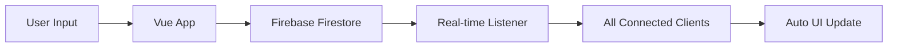

# Gabut - Anonymous Message Platform

> Aplikasi realtime voting untuk pesan dengan sistem upvote/downvote yang interaktif dan sinkronisasi cloud

Aplikasi web modern yang memungkinkan pengguna untuk berbagi pesan secara anonim dan memberikan vote (upvote/downvote) secara realtime. Aplikasi ini dilengkapi dengan sistem ranking, sorting, dan penyimpanan data cloud menggunakan **Firebase Firestore** untuk sinkronisasi multi-device.

## Fitur Utama

### Core Features

- **Cloud Synchronization** - Data tersinkron real-time di semua perangkat menggunakan Firebase Firestore
- **Real-time Voting System** - Upvote dan downvote pesan secara instant dengan update otomatis
- **Anonymous Messaging** - Input dan submit pesan tanpa registrasi
- **Cross-Device Access** - Akses data dari perangkat manapun, data tidak akan hilang
- **Responsive Design** - Tampilan optimal di desktop, tablet, dan mobile

### Advanced Features

- **Multi-mode Sorting**:
  - 🏆 Skor Tertinggi ke Terendah
  - 📉 Skor Terendah ke Tertinggi
  - 🕐 Pesan Terbaru
  - 📅 Pesan Terlama

- **Dynamic Ranking System**:
  - 🥇 Badge Top #1 (Gold) dengan highlight khusus
  - 🥈 Badge Top #2 (Silver) dengan border abu-abu
  - 🥉 Badge Top #3 (Bronze) dengan border orange
  - Real-time rank updates

## Tech Stack

- **Frontend Framework**: Vue.js 3 (Composition API)
- **Build Tool**: Vite 7
- **Styling**: Tailwind CSS (via CDN)
- **State Management**: Vue Reactive & Computed Properties
- **Backend/Database**: Firebase Firestore (NoSQL Cloud Database)
- **Real-time Updates**: Firebase onSnapshot (WebSocket-based)
- **Language**: JavaScript ES6+ with modern async/await

## Installation & Setup

### Prerequisites

- **Node.js** (v20.19.0 atau lebih tinggi)
- **npm** atau yarn
- **Firebase Account** (gratis)

### Quick Setup

1. **Clone repository**

   ```bash
   git clone https://github.com/gbennnn/gabut.git
   cd gabut
   ```

2. **Install dependencies**

   ```bash
   npm install
   ```

3. **Setup Firebase**

   ```bash
   # Copy template Firebase config
   cp src/firebase.template.js src/firebase.js
   ```

4. **Configure Firebase**
   - Buat project baru di [Firebase Console](https://console.firebase.google.com/)
   - Enable Firestore Database
   - Copy config dari Project Settings
   - Paste ke `src/firebase.js`
   - Lihat panduan lengkap di `FIREBASE_SETUP.md`

5. **Run development server**

   ```bash
   npm run dev
   ```

6. **Open browser**
   ```
   http://localhost:5173
   ```

### Production Build

```bash
# Build untuk production
npm run build

# Preview build hasil
npm run preview

# Deploy ke hosting (contoh: Vercel)
npm run build && vercel --prod
```

## Data Structure

### Message Object (Firestore Document)

```javascript
{
  id: String,              // Auto-generated Firestore document ID
  text: String,            // Message content (max 1000 chars)
  upvotes: Number,         // Total upvotes (default: 0)
  downvotes: Number,       // Total downvotes (default: 0)
  timestamp: Timestamp,    // Firebase server timestamp
  createdAt: String        // ISO string for backup sorting
}
```

### Firestore Collection Structure

```
📁 messages (collection)
  📄 documentId1
    ├── text: "Hello world!"
    ├── upvotes: 5
    ├── downvotes: 1
    ├── timestamp: Firebase Timestamp
    └── createdAt: "2025-08-04T12:00:00.000Z"
  📄 documentId2
    ├── text: "Another message"
    ├── upvotes: 2
    ├── downvotes: 0
    └── ...
```

### Real-time Data Flow



## Security & Privacy

### Firestore Security Rules

```javascript
rules_version = '2';
service cloud.firestore {
  match /databases/{database}/documents {
    match /messages/{messageId} {
      // Anyone can read messages
      allow read: if true;

      // Anyone can create messages with proper structure
      allow create: if request.resource.data.keys().hasAll(['text', 'upvotes', 'downvotes', 'timestamp']) &&
        request.resource.data.text is string &&
        request.resource.data.text.size() <= 1000;

      // Anyone can update upvotes/downvotes only
      allow update: if request.resource.data.diff(resource.data).affectedKeys().hasOnly(['upvotes', 'downvotes']);

      // No deletes allowed
      allow delete: if false;
    }
  }
}
```

### Privacy Features

- **Fully Anonymous** - No user registration or tracking
- **Server-side Validation** - Firebase rules prevent malicious data
- **No Personal Data** - Only message content and votes stored
- **HTTPS Only** - All Firebase communication encrypted

## License

Distributed under the **MIT License**. See `LICENSE` for more information.

## Links

- **Live Demo**: [gabut.vercel.app](gabut-five-phi.vercel.app)
- **Report Bug**: [GitHub Issues](https://github.com/gbennnn/gabut/issues)
- **Request Feature**: [GitHub Discussions](https://github.com/gbennnn/gabut/discussions)

---

<div align="center">
  <p>⭐ Star this repo if you find it helpful!</p>
  <p>Made with ❤️ using Vue.js and Firebase</p>
</div>
